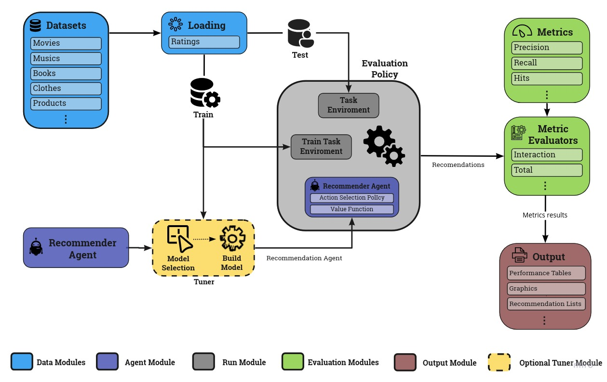

# **irec - Interactive Recommender Systems Library**


This is a specialized library containing Multi-Armed Bandit, Active
Learning and others methods.

A full environment to code yours Reinforcement Learning Recommender
Systems.



We present the initial version of our **Framework**, which focuses on evaluating SR techniques based on **Reinforcement Learning** in general. Our goal is to encourage the evaluation of reproducible offline experiments by providing simple building blocks for running robust experiments and an extremely intuitive platform. Our framework can be used to share environments reference SRs and reusable implementations of reference RS agents. Thus, we built a complete structure, from data entry and manipulation to the evaluation of the results obtained, using several evaluation metrics that are perfectly capable of measuring the quality of the recommendation.

Unlike existing frameworks, our structure has the most recent and relevant RL algorithms published so far, in addition to providing different forms and evaluation metrics, generalizable in different situations and ideal for the scenario of recommendation systems.

## Installation

Currently, we are supporting Python 3. There are several ways to install irec:

- **From PyPI:**
  ```bash
  pip3 install irec
  ```

- **From the GitHub source (for latest updates):**
  ```bash
  git clone https://github.com/heitor57/irec.git
  cd irec
  pip install -r requirements.txt
  ```

## Datasets

Our framework has the ability to use any type of dataset, as long as it is suitable for the recommendation scenario and is formatted correctly. Below we list some of the datasets tested and used in some of our experiments.

| Dataset | Scenery  | Sparsity | Link
| :---: | --- | :---: | :---: |
MovieLens 100k |  Movies | 93.69% | [Link](https://grouplens.org/datasets/movielens/100k/)
MovieLens 1M | Movies | 95.80% | [Link](https://grouplens.org/datasets/movielens/1m/)
MovieLens 10M |  Movies | 98.66% | [Link](https://grouplens.org/datasets/movielens/10m/)
Netflix | Movies | 98.69% | [Link](link)
Ciao DVD | Movies | 99.97% | [Link](http://konect.cc/networks/librec-ciaodvd-movie_ratings/)	
Yahoo Music |  Musics | 97.63% | [Link](https://webscope.sandbox.yahoo.com/catalog.php?datatype=r)
LastFM | Musics | 99.84% | [Link](http://ocelma.net/MusicRecommendationDataset/lastfm-360K.html)
Good Books |  Books | 98.88% | [Link](https://www.kaggle.com/zygmunt/goodbooks-10k?select=ratings.csv)
Good Reads | Books | 99.50% | [Link](https://www.kaggle.com/sahilkirpekar/goodreads10k-dataset-cleaned?select=Ratings.csv)
Amazon Kindle Store | Products | 99.97% | [Link](https://jmcauley.ucsd.edu/data/amazon/)	
Clothing Fit | Clothes | 99.97% | [Link](link)	

## Models

The recommender models supported by irec are listed below.

| Year | Model  | Paper | Description
| :---: | --- | :---: | :---: |
| 2002 | [ε-Greedy](irec/value_functions/EGreedy.py) | [Link](https://link.springer.com/article/10.1023/A:1013689704352) | In general, ε-Greedy models the problem based on an ε diversification parameter to perform random actions.   
| 2013 | [Linear EGreedy](irec/value_functions/LinearEGreedy.py) | [Link](https://dl.acm.org/doi/abs/10.1145/2505515.2505690?casa_token=1PDIAs6p1ysAAAAA:ZFkzkEnCX1_ZiqSCAgqOw9Z3mOPybhJLRtAdkfnEagDI_aef1TR7SD3IZkkVhs2hTzk_FkigZ548) | A linear exploitation of the items latent factors defined by a PMF formulation that also explore random items with probability ε.   
| 2011 | [Thompson Sampling](irec/value_functions/ThompsonSampling.py) | [Link](https://citeseerx.ist.psu.edu/viewdoc/download?doi=10.1.1.831.5818&rep=rep1&type=pdf) |  A basic item-oriented bandit algorithm that follows a Gaussian distribution of items and users to perform the prediction rule based on their samples.
| 2013 | [GLM UCB](irec/value_functions/GLM_UCB.py) | [Link](https://dl.acm.org/doi/abs/10.1145/2505515.2505690?casa_token=cCSF9jXF2VMAAAAA:zpD_LhYXadYz5BAm5-R_SpSA4za8EGH4U98mbbxquS6BZFLFM2tylXVemkgW9033knXcqB_kumP5) | It follows a similar process as Linear UCB based on the PMF formulation, but it also adds a sigmoid form in the exploitation step and makes a time-dependent exploration.   
| 2018 | [ICTR](irec/value_functions/ICTR.py) | [Link](https://ieeexplore.ieee.org/abstract/document/8440090/) | It is an interactive collaborative topic regression model that utilizes the TS bandit algorithm and controls the items dependency by a particle learning strategy.
| 2015 | [PTS](irec/value_functions/PTS.py) | [Link](http://papers.nips.cc/paper/5985-efficient-thompson-sampling-for-online-matrix--factorization-recommendation.pdf) | It is a PMF formulation for the original TS based on a Bayesian inference around the items. This method also applies particle filtering to guide the exploration of items over time.   
| 2019 | [Knn Bandit](irec/value_functions/kNNBandit.py) | [Link](https://dl.acm.org/doi/abs/10.1145/3298689.3347040) | A simple multi-armed bandit elaboration of neighbor-based collaborative filtering. A variant of the nearest-neighbors scheme, but endowed with a controlled stochastic exploration capability of the users’ neighborhood, by a parameter-free application of Thompson sampling. 
| 2017 | [Linear TS](irec/value_functions/LinearThompsonSampling.py) | [Link](http://proceedings.mlr.press/v54/abeille17a) | An adaptation of the original Thompson Sampling to measure the latent dimensions by a PMF formulation.
| 2013 | [Linear UCB](irec/value_functions/LinearUCB.py) | [Link](https://dl.acm.org/doi/abs/10.1145/2505515.2505690?casa_token=qJlau402jGcAAAAA:Wo57x-INaZl6bhdv-V8ab391I2GJ6SWxE9unEnRtg0urLVS5sISCdhR0REJRJGlM9bdAb3Jw_Fti) | An adaptation of the original LinUCB (Lihong Li et al. 2010) to measure the latent dimensions by a PMF formulation.   
| 2020 | [NICF](irec/value_functions/NICF.py) | [Link](https://dl.acm.org/doi/abs/10.1145/2505515.2505690?casa_token=MllrAXlioLsAAAAA:qnXgeSAEJF1jhTD7PNiDWFFr-FAET4vOHluesRPSCvxGuw3EfEeSnYokqCQKj3cNH0-v_I43UQE0) | It is an interactive method based on a combination of neural networks and  collaborative filtering that also performs a meta-learning of the user’s preferences.   
| 2016 | [COFIBA](irec/value_functions/COFIBA.py) | [Link](https://dl.acm.org/doi/abs/10.1145/2911451.2911548?casa_token=UpXzuWNaGHUAAAAA:jQR2gPPq2plKCg2mqLMoJAn5l6BBd2fWi4oxw9DJN0LZ9r-03PLqb8qEKuNDD0DXcgp6N8W6x39b) | This method relies on upper-confidence-based tradeoffs between exploration and exploitation, combined with adaptive clustering procedures at both the user and the item sides.
| 2002 | [UCB](irec/value_functions/UCB.py) | [Link](https://link.springer.com/article/10.1023/A:1013689704352) | It is the original UCB that calculates a confidence interval for each item at each iteration and tries to shrink the confidence bounds.
| 2002 | [Entropy](irec/value_functions/Entropy.py) | [Link](https://dl.acm.org/doi/pdf/10.1145/502716.502737?casa_token=tQ6DkQMJnW0AAAAA:d3kGkV18mjoXwEDDMQmy4UBRMe9ZoZ-mCOeOqkZKgVCiIRpGolKB2M0RXm4ouePTuWkOgVhgBKh7) | The entropy of an item i is calculated using the relative frequency of each of the possible ratings ratings. In general, since entropy measures the spread of ratings for an item, this strategy tends to promote rarely rated items, which can be considerably informative.
| 2002 | [LogPopEnt](irec/value_functions/LogPopEnt.py) | [Link](https://dl.acm.org/doi/pdf/10.1145/502716.502737?casa_token=tQ6DkQMJnW0AAAAA:d3kGkV18mjoXwEDDMQmy4UBRMe9ZoZ-mCOeOqkZKgVCiIRpGolKB2M0RXm4ouePTuWkOgVhgBKh7) | It combines popularity and entropy to identify potentially relevant items that also have the ability to add more knowledge to the system. As these concepts are not strongly correlated, it is possible to achieve this combination through a linear combination of the popularity ρ of an item i by its entropy ε: score(i) = log(ρi) · εi.
| - | [Random](irec/value_functions/Random.py) | [Link](link) | This method recommends totally random items.  
| - | [MostPopular](irec/value_functions/MostPopular.py) | [Link](link) | It recommends items with the higher number of ratings received (most-popular) at each iteration.  
| - | [BestRated](irec/value_functions/BestRated.py) | [Link](link) | Recommends top-rated items based on their average ratings in each iteration.

<!-- | 2021 | [WSPB](reposit) | [Link](link) | The best -->
<!-- | 2013 | [LinEgreedy](reposit) | [Link](https://dl.acm.org/doi/abs/10.1145/2505515.2505690?casa_token=qJlau402jGcAAAAA:Wo57x-INaZl6bhdv-V8ab391I2GJ6SWxE9unEnRtg0urLVS5sISCdhR0REJRJGlM9bdAb3Jw_Fti) | -->
<!-- | 2010 | [LinUCB](reposit) | [Link](https://dl.acm.org/doi/abs/10.1145/1772690.1772758?casa_token=0DH2lK1XlgMAAAAA:rw-99PWUUWSR5sH7lfOs3bcn_2wahVraUPE7l7iqGh8p3d2mFBuvYnKax-HirKgEMqGTrCjceJMv) | adaptation of LinUCB, defining the contexts as latent factors of the SVD and exploring the uncertainty of the items and users through the confidence interval ||qi||. -->

## Metrics

The recommender metrics supported by Cornac are listed below.

| Metric | Reference | Description
| :---: | --- | :---: |
| [Hits](https://github.com/heitor57/irec/blob/24a28734f757e95d1423dac4ada9dfb85fa05b73/irec/metrics.py#L183) | [Link](link) | Number of recommendations made successfully. 
| [Precision](https://github.com/heitor57/irec/blob/24a28734f757e95d1423dac4ada9dfb85fa05b73/irec/metrics.py#L139) | [Link](link) | Precision is defined as the percentage of predictions we get right.
| [Recall](https://github.com/heitor57/irec/blob/24a28734f757e95d1423dac4ada9dfb85fa05b73/irec/metrics.py#L97) | [Link](link) | Represents the probability that a relevant item will be selected.  
| [EPC](https://github.com/heitor57/irec/blob/24a28734f757e95d1423dac4ada9dfb85fa05b73/irec/metrics.py#L232) | [Link](link) | It represents the novelty for each user and it is measured by the expected number of seen relevant recommended items not previously seen.  
| [EPD](https://github.com/heitor57/irec/blob/24a28734f757e95d1423dac4ada9dfb85fa05b73/irec/metrics.py#L359) | [Link](link) | EPD is a distance-based novelty measure, which looks at distances between the items inthe user’s profile and the recommended items. 
| [ILD](https://github.com/heitor57/irec/blob/24a28734f757e95d1423dac4ada9dfb85fa05b73/irec/metrics.py#L312) | [Link](link) | It represents the diversity between the list of items recommended. This diversity is measure by the Pearson correlation of the item’s features vector. 
| [Gini Coefficient](https://github.com/heitor57/irec/blob/24a28734f757e95d1423dac4ada9dfb85fa05b73/irec/metrics.py#L449)| [Link](link) | Diversity is represented as the Gini coefficient – a measure of distributional inequality. It is measured as the inverse of cumulative frequency that each item is recommended.
| [Users Coverage](https://github.com/heitor57/irec/blob/24a28734f757e95d1423dac4ada9dfb85fa05b73/irec/metrics.py#L498) | [Link](link) | It represents the percentage of distinctusers that are interested in at least k items recommended (k ≥ 1).
<!-- | [NDCG](reposit) | A diversity metric | [Link](link)  -->
<!-- | [F-Measure](reposit) | desc | [Link](link) -->
<!-- | [MAE](reposit) | desc | [Link](link)  -->
<!-- | [RMSE](reposit) | desc | [Link](link)  -->

## Configuration Files

[**dataset_loaders.yaml**](app/settings/dataset_loaders.yaml)

```yaml
'MovieLens 10M':
  dataset_path: ./data/datasets/MovieLens 10M/
  train_size: 0.8
  test_consumes: 1
  crono: False
  random_seed: 0
︙
```

[**dataset_agents.yaml**](app/settings/dataset_agents.yaml)
```yaml
'MovieLens 10M':
  LinearUCB:
    SimpleAgent:
      action_selection_policy:
        ASPGreedy: {}
      value_function:
        LinearUCB:
          alpha: 1.0
          item_var: 0.01
          iterations: 20
          num_lat: 20
          stop_criteria: 0.0009
          user_var: 0.01
          var: 0.05
 ︙
```

[**evaluation_policies.yaml**](app/settings/evaluation_policies.yaml)

```yaml
Interaction:
  num_interactions: 100
  interaction_size: 1
  save_info: False

︙
```

[**metric_evaluators.yaml**](app/settings/metric_evaluators.yaml)

```yaml
UserCumulativeInteractionMetricEvaluator:
  interaction_size: 1
  interactions_to_evaluate:
    - 5
    - 10
    - 20
    - 50
    - 100
  num_interactions: 100
  relevance_evaluator_threshold: 3.999

︙
```

[**defaults.yaml**](app/settings/defaults.yaml)
```yaml
agent: LinearUCB
agent_experiment: agent
data_dir: data/
dataset_experiment: dataset
dataset_loader: 'MovieLens 1M'
evaluation_experiment: evaluation
evaluation_policy: Interaction
metric: Hits
metric_evaluator: UserCumulativeInteractionMetricEvaluator
pdf_dir: pdf/
tex_dir: tex/
```

For more details on configuration files, go to [**configuration_files**](tutorials/configuration_files.ipynb)

## Experiment

```python
import libs
# load data
# load models
# define metrics to evaluate the models
# run!
```

**Output:**

insert example of output

For more details, please take a look at our [examples](examples)

## Citation

If you use irec in a scientific publication, we would appreciate citations to the following papers:

- [paper](link), autors, conf, year

  ```
  @article{article,
    title={title},
    author={authors},
    journal={journal},
    year={2021}
  }
  ```

## License

[MIT License](LICENSE)
