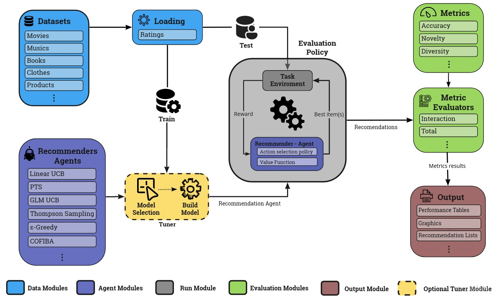

# Welcome to iRec documentation!

This is a specialized library containing Multi-Armed Bandit, Active Learning and others methods. A full environment to code yours Reinforcement Learning Recommender Systems. Our goal is to encourage the evaluation of reproducible offline experiments by providing simple building blocks for running robust experiments and an extremely intuitive platform. Our framework can be used to share environments reference SRs and reusable implementations of reference RS agents. Thus, we built a complete structure, from data entry and manipulation to the evaluation of the results obtained, using several evaluation metrics that are perfectly capable of measuring the quality of the recommendation.

Unlike existing frameworks, our structure has the most recent and relevant RL algorithms published so far, in addition to providing different forms and evaluation metrics, generalizable in different situations and ideal for the scenario of recommendation systems.

## Main features:

- Several state-of-the-art reinforcement learning models for the recommendation scenario
- Novelty, coverage and much more different type of online metrics
- Integration with the most used datasets for evaluating recommendation systems
- Flexible configuration
- Modular and reusable design
- Contains multiple evaluation policies currently used in the literature to evaluate reinforcement learning models
- Online Learning and Reinforcement Learning models
- Metrics and metrics evaluators are awesome to evaluate recommender systems in different ways

Also, we provide a amazing application created using the iRec library (under the app/ folder) that can be used to setup a experiment under 5~ minutes with parallel processes, log registry and results views. The main features are:

- Powerful application to run any reinforcement learning experiment powered by MLflow
- Entire pipeline of execution is fully parallelized
- Log registry
- Results views
- Statistical test
- Extensible environment

## GET STARTED

* [Introduction](guide/introduction.md)
* [Install iRec](guide/install_irec.md)
* [Quick Start](guide/quick_start.md)
* [Release Notes](guide/release_notes.md)

## RUNNING EXPERIMENTS

* [Configurations Files](run_exp/configuration_files.md)
* [Running an Experiment](run_exp/run_experiment.md)

## MODULES

* [Models](modules/models.md)
* [Evaluation Policies](modules/evaluation_policies.md)
* [Metric Evaluators](modules/metric_evaluators.md)
* [Metrics](modules/metrics.md)

<!-- 
## Commands

* `mkdocs new [dir-name]` - Create a new project.
* `mkdocs serve` - Start the live-reloading docs server.
* `mkdocs build` - Build the documentation site.
* `mkdocs -h` - Print help message and exit.

## Project layout

    mkdocs.yml    # The configuration file.
    docs/
        index.md  # The documentation homepage.
        ...       # Other markdown pages, images and other files.
 -->
